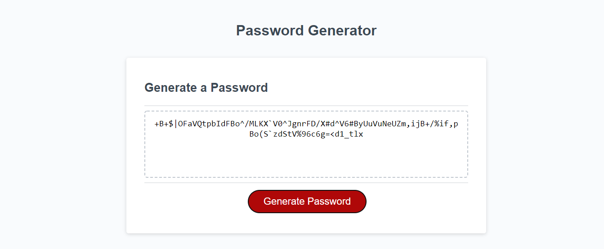

# secure-password-generator

## The Repository
This repository contains a random password generator web page that can create a strong password that provides greater secruity.

### The Purpose
The password generator application makes it easier for employees to generate a random password based on criteria they’ve selected by modifying starter code. This app runs in the browser, and features dynamically updated HTML and CSS powered by JavaScript code. It has a clean and polished user interface that is responsive, ensuring that it adapts to multiple screen sizes.

### How it Works
* Click the button to generate a password. 
* You will be presented with a series of prompts for password criteria.
* Start by choose a length of at least 8 characters and no more than 128 characters.
* Next choose character types of lowercase, uppercase, numeric, and/or special characters
* Input is validated and at least one character must be selected
* When all prompts are answered, a password is generated that matches the selected criteria
* The password is then written to the page

## Screenshot of deployed page:

## Link to deployed application:

The deployed application [secure-password-generator](https://robel-codes.github.io/secure-password-generator/)

